# UML Diagrams - Ride-Sharing and Renting Platform

## 📋 Overview

This document contains comprehensive UML diagrams showing the complete system architecture, data models, and relationships. All diagrams are rendered using **Mermaid diagram syntax** and follow standard UML 2.0 conventions.

### Diagram Types Included

| # | Diagram Type | Purpose | Location |
|---|---|---|---|
| 1-7 | **Class Diagrams** | Entity relationships, inheritance, composition | Section: Class Diagrams |
| 1-4 | **Sequence Diagrams** | Workflow interactions and message flows | Section: Sequence Diagrams |
| 1 | **Component Diagram** | Microservices architecture | Section: Component Diagram |
| 1 | **Entity-Relationship Diagram** | Database schema and relationships | Section: Entity-Relationship Diagram |
| 1 | **Use Case Diagram** | System capabilities by user role | Section: Use Case Diagram |
| 1-3 | **State Diagrams** | Status transitions and state machines | Section: State Diagrams |
| 1 | **Deployment Diagram** | Infrastructure and container setup | Section: Deployment Diagram |
| 2 | **Technology Stack** | Tools and frameworks overview | Section: Technology Stack Overview |

### How to Read These Diagrams

1. **Open the markdown file** in VS Code or any markdown viewer that supports Mermaid
2. **Diagrams render automatically** - no additional tools needed
3. **Use the notation guide** below to understand UML symbols
4. **Check multiplicity** on associations to understand cardinality (1-to-1, 1-to-many, etc.)

---

## Table of Contents
1. [Class Diagrams](#class-diagrams)
2. [Sequence Diagrams](#sequence-diagrams)
3. [Component Diagram](#component-diagram)
4. [Entity-Relationship Diagram](#entity-relationship-diagram)
5. [Use Case Diagram](#use-case-diagram)
6. [State Diagrams](#state-diagrams)
7. [Deployment Diagram](#deployment-diagram)
8. [Technology Stack Overview](#technology-stack-overview)

---

## Class Diagrams

### UML Notation Guide

This documentation uses standard UML class diagram notations:

| Notation | Meaning | Example |
|----------|---------|---------|
| `<\|--` | **Inheritance** - Child class extends parent class | `OwnerAccount <\|-- UserAccount` |
| `*--` | **Composition** - Strong ownership, part cannot exist without whole | `AuthService *-- UserAccountRepository` |
| `o--` | **Aggregation** - Weak ownership, part can exist independently | `Dashboard o-- ReportCard` |
| `-->` | **Association** - General relationship between classes | `Rental --> RentalStatus` |
| `..>` | **Dependency** - One class depends on another (uses) | `CreateBikeRequest ..> BikeResponse` |
| `..\|>` | **Realization** - Class implements an interface | `AuthService ..\|> AuthServiceInterface` |

**Access Modifiers:**
- `-` Private
- `+` Public  
- `#` Protected
- `~` Package-private

**Multiplicity (on associations):**
- `1` - Exactly one
- `*` - Zero or more
- `0..*` - Zero or more
- `1..*` - One or more

### Visual Arrow Reference

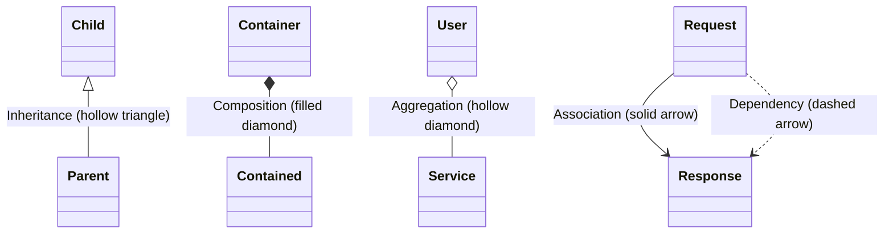
```mermaid
classDiagram
    class Parent
    class Child
    class Container
    class Contained
    class User
    class Service
    class Request
    class Response
    
    Child <|-- Parent : Inheritance (hollow triangle)
    Container *-- Contained : Composition (filled diamond)
    User o-- Service : Aggregation (hollow diamond)
    Request --> Response : Association (solid arrow)
    Request ..> Response : Dependency (dashed arrow)
```

This diagram above shows the **actual visual arrow styles** used throughout this documentation:
- **Hollow triangle** pointing up = Inheritance
- **Filled diamond** = Composition (strong ownership)
- **Hollow diamond** = Aggregation (weak ownership)
- **Solid arrow** = Association
- **Dashed arrow** = Dependency

---

### 1. Auth Service Domain Model with Inheritance

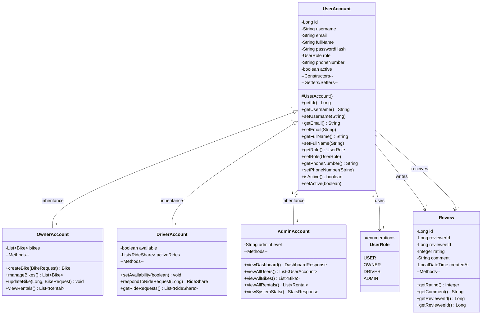
```mermaid
classDiagram
    %% Enumerations
    class UserRole {
        <<enumeration>>
        USER
        OWNER
        DRIVER
        ADMIN
    }
    
    %% Base Class
    class UserAccount {
        -Long id
        -String username
        -String email
        -String fullName
        -String passwordHash
        -UserRole role
        -String phoneNumber
        -boolean active
        --Constructors--
        #UserAccount()
        --Getters/Setters--
        +getId() Long
        +getUsername() String
        +setUsername(String)
        +getEmail() String
        +setEmail(String)
        +getFullName() String
        +setFullName(String)
        +getRole() UserRole
        +setRole(UserRole)
        +getPhoneNumber() String
        +setPhoneNumber(String)
        +isActive() boolean
        +setActive(boolean)
    }
    
    %% Subclasses
    class OwnerAccount {
        -List~Bike~ bikes
        --Methods--
        +createBike(BikeRequest) Bike
        +manageBikes() List~Bike~
        +updateBike(Long, BikeRequest) void
        +viewRentals() List~Rental~
    }
    
    class DriverAccount {
        -boolean available
        -List~RideShare~ activeRides
        --Methods--
        +setAvailability(boolean) void
        +respondToRideRequest(Long) RideShare
        +getRideRequests() List~RideShare~
    }
    
    class AdminAccount {
        -String adminLevel
        --Methods--
        +viewDashboard() DashboardResponse
        +viewAllUsers() List~UserAccount~
        +viewAllBikes() List~Bike~
        +viewAllRentals() List~Rental~
        +viewSystemStats() StatsResponse
    }
    
    %% Associated Classes
    class Review {
        -Long id
        -Long reviewerId
        -Long revieweeId
        -Integer rating
        -String comment
        -LocalDateTime createdAt
        --Methods--
        +getRating() Integer
        +getComment() String
        +getReviewerId() Long
        +getRevieweeId() Long
    }
    
    %% Relationships
    UserAccount "1" <|-- "1" OwnerAccount : inheritance
    UserAccount "1" <|-- "1" DriverAccount : inheritance
    UserAccount "1" <|-- "1" AdminAccount : inheritance
    
    UserAccount "1" --> "1" UserRole : uses
    UserAccount "1" --> "*" Review : writes
    UserAccount "1" --> "*" Review : receives
```

### 2. Bike Service Domain Model

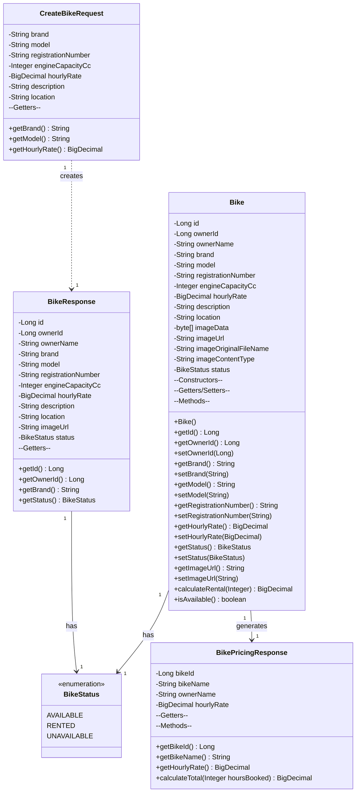
```mermaid
classDiagram
    %% Enumerations
    class BikeStatus {
        <<enumeration>>
        AVAILABLE
        RENTED
        UNAVAILABLE
    }
    
    %% Main Classes
    class Bike {
        -Long id
        -Long ownerId
        -String ownerName
        -String brand
        -String model
        -String registrationNumber
        -Integer engineCapacityCc
        -BigDecimal hourlyRate
        -String description
        -String location
        -byte[] imageData
        -String imageUrl
        -String imageOriginalFileName
        -String imageContentType
        -BikeStatus status
        --Constructors--
        +Bike()
        --Getters/Setters--
        +getId() Long
        +getOwnerId() Long
        +setOwnerId(Long)
        +getBrand() String
        +setBrand(String)
        +getModel() String
        +setModel(String)
        +getRegistrationNumber() String
        +setRegistrationNumber(String)
        +getHourlyRate() BigDecimal
        +setHourlyRate(BigDecimal)
        +getStatus() BikeStatus
        +setStatus(BikeStatus)
        +getImageUrl() String
        +setImageUrl(String)
        --Methods--
        +calculateRental(Integer) BigDecimal
        +isAvailable() boolean
    }
    
    class BikePricingResponse {
        -Long bikeId
        -String bikeName
        -String ownerName
        -BigDecimal hourlyRate
        --Getters--
        +getBikeId() Long
        +getBikeName() String
        +getHourlyRate() BigDecimal
        --Methods--
        +calculateTotal(Integer hoursBooked) BigDecimal
    }
    
    class CreateBikeRequest {
        -String brand
        -String model
        -String registrationNumber
        -Integer engineCapacityCc
        -BigDecimal hourlyRate
        -String description
        -String location
        --Getters--
        +getBrand() String
        +getModel() String
        +getHourlyRate() BigDecimal
    }
    
    class BikeResponse {
        -Long id
        -Long ownerId
        -String ownerName
        -String brand
        -String model
        -String registrationNumber
        -Integer engineCapacityCc
        -BigDecimal hourlyRate
        -String description
        -String location
        -String imageUrl
        -BikeStatus status
        --Getters--
        +getId() Long
        +getOwnerId() Long
        +getBrand() String
        +getStatus() BikeStatus
    }
    
    %% Relationships
    Bike "1" --> "1" BikeStatus : has
    CreateBikeRequest "1" ..> "1" BikeResponse : creates
    Bike "1" --> "1" BikePricingResponse : generates
    BikeResponse "1" --> "1" BikeStatus : has
```

### 3. Rental Service Domain Model


```mermaid
classDiagram
    %% Enumerations
    class RentalStatus {
        <<enumeration>>
        PENDING_PAYMENT
        PAYMENT_CONFIRMED
        AWAITING_PICKUP
        COMPLETED
        CANCELLED
    }
    
    class SlipUploaderRole {
        <<enumeration>>
        USER
        OWNER
    }
    
    %% Main Classes
    class Rental {
        -Long id
        -Long bikeId
        -String bikeName
        -Long ownerId
        -Long userId
        -String userName
        -Integer hoursBooked
        -BigDecimal hourlyRate
        -BigDecimal totalAmount
        -RentalStatus status
        -LocalDateTime pickupTime
        -LocalDateTime returnTime
        -String paymentReference
        -byte[] paymentSlip
        -String slipOriginalFileName
        -String slipContentType
        -SlipUploaderRole slipUploadedBy
        -String notes
        --Constructors--
        +Rental()
        --Getters/Setters--
        +getId() Long
        +getBikeId() Long
        +getUserId() Long
        +getOwnerId() Long
        +getStatus() RentalStatus
        +setStatus(RentalStatus)
        +getTotalAmount() BigDecimal
        +setTotalAmount(BigDecimal)
        --Methods--
        +uploadPaymentSlip(file, uploaderRole) void
        +deletePaymentSlip() void
        +getPaymentSlipData() byte[]
        +canCompleteRental() boolean
    }
    
    class CreateRentalRequest {
        -Long bikeId
        -Integer hoursBooked
        -LocalDateTime pickupTime
        -String notes
        --Constructors--
        +CreateRentalRequest()
        --Getters--
        +getBikeId() Long
        +getHoursBooked() Integer
        +getPickupTime() LocalDateTime
        --Methods--
        +validate() boolean
        +isValidPickupTime() boolean
    }
    
    class RentalResponse {
        -Long id
        -Long bikeId
        -String bikeName
        -Long ownerId
        -Long userId
        -String userName
        -Integer hoursBooked
        -BigDecimal hourlyRate
        -BigDecimal totalAmount
        -RentalStatus status
        -LocalDateTime pickupTime
        -LocalDateTime returnTime
        -String paymentReference
        -String slipFileName
        -SlipUploaderRole slipUploadedBy
        -String notes
        --Getters--
        +getId() Long
        +getBikeId() Long
        +getUserId() Long
        +getStatus() RentalStatus
        +getTotalAmount() BigDecimal
    }
    
    %% Relationships
    Rental "1" --> "1" RentalStatus : has
    Rental "1" --> "1" SlipUploaderRole : tracks
    CreateRentalRequest "1" ..> "1" Rental : creates
    Rental "1" --> "1" RentalResponse : generates
    RentalResponse "1" --> "1" RentalStatus : has
    RentalResponse "1" --> "1" SlipUploaderRole : tracks
```

### 4. Service Layer Architecture


```mermaid
classDiagram
    %% Interfaces/Repositories
    class UserAccountRepository {
        <<interface>>
        +findByUsername(String) UserAccount
        +findByEmail(String) UserAccount
        +findByRole(UserRole) List~UserAccount~
        +existsByUsername(String) boolean
        +existsByEmail(String) boolean
        +save(UserAccount) UserAccount
        +findAll() List~UserAccount~
        +findById(Long) Optional~UserAccount~
        +delete(UserAccount) void
    }
    
    class BikeRepository {
        <<interface>>
        +findByStatus(BikeStatus) List~Bike~
        +findByOwnerId(Long) List~Bike~
        +findById(Long) Optional~Bike~
        +existsByRegistrationNumber(String) boolean
        +save(Bike) Bike
        +findAll() List~Bike~
        +delete(Bike) void
    }
    
    class RentalRepository {
        <<interface>>
        +findByUserId(Long) List~Rental~
        +findByOwnerId(Long) List~Rental~
        +findByStatus(RentalStatus) List~Rental~
        +findById(Long) Optional~Rental~
        +save(Rental) Rental
        +findAll() List~Rental~
        +delete(Rental) void
    }
    
    %% PasswordEncoder
    class PasswordEncoder {
        <<interface>>
        +encode(String) String
        +matches(String, String) boolean
    }
    
    %% RestClient
    class RestClient {
        <<interface>>
        +get(String) HTTP Response
        +post(String, Object) HTTP Response
        +patch(String, Object) HTTP Response
        +delete(String) HTTP Response
    }
    
    %% Service Classes
    class AuthService {
        -UserAccountRepository userRepository
        -PasswordEncoder passwordEncoder
        --Constructors--
        +AuthService(UserAccountRepository, PasswordEncoder)
        --Methods--
        +register(RegisterRequest) UserResponse
        +login(LoginRequest) UserResponse
        +getAllUsers() List~UserResponse~
        +getUserStats() StatsResponse
        -hashPassword(String) String
        -validatePassword(String, String) boolean
    }
    
    class BikeService {
        -BikeRepository bikeRepository
        -RestClient restClient
        --Constructors--
        +BikeService(BikeRepository, RestClient)
        --Methods--
        +createBike(CreateBikeRequest, MultipartFile) BikeResponse
        +getAvailableBikes() List~BikeResponse~
        +getOwnerBikes(Long ownerId) List~BikeResponse~
        +getPricing(Long bikeId) BikePricingResponse
        +getBikeImage(Long bikeId) Resource
        +updateStatus(Long bikeId, BikeStatus) void
        -uploadImage(MultipartFile) byte[]
        -saveImageAsBlob(byte[]) void
    }
    
    class RentalService {
        -RentalRepository rentalRepository
        -RestClient bikeClient
        --Constructors--
        +RentalService(RentalRepository, RestClient)
        --Methods--
        +createRental(CreateRentalRequest) RentalResponse
        +uploadSlip(Long, MultipartFile, SlipUploaderRole) void
        +deleteSlip(Long) void
        +updateStatus(Long, RentalStatus, String) void
        +getUserRentals(Long userId) List~RentalResponse~
        +getOwnerRentals(Long ownerId) List~RentalResponse~
        +getPaymentSlip(Long rentalId) Resource
        +getRentalStats() StatsResponse
        -callBikeService(Long) BikePricingResponse
        -calculateTotalAmount(BigDecimal, Integer) BigDecimal
        -uploadSlipAsBlob(byte[]) void
    }
    
    class AdminService {
        -AuthService authService
        -BikeService bikeService
        -RentalService rentalService
        --Constructors--
        +AdminService(AuthService, BikeService, RentalService)
        --Methods--
        +getDashboard() DashboardResponse
        -aggregateStats() DashboardResponse
        -getUserStats() StatsDto
        -getBikeStats() StatsDto
        -getRentalStats() StatsDto
    }
    
    %% DTOs
    class StatsResponse {
        -Integer totalUsers
        -Integer totalOwners
        -Integer totalDrivers
        -Integer totalAdmins
        -Integer totalBikes
        -Integer totalRentals
        -Integer completedRentals
    }
    
    class DashboardResponse {
        -Integer totalUsers
        -Integer totalBikes
        -Integer totalRentals
        -BigDecimal totalRevenue
        -Integer completedRentals
        -List~RentalResponse~ recentRentals
    }
    
    %% Relationships - Composition (filled diamonds)
    AuthService "1" *-- "1" UserAccountRepository : contains
    AuthService "1" *-- "1" PasswordEncoder : contains
    BikeService "1" *-- "1" BikeRepository : contains
    BikeService "1" *-- "1" RestClient : contains
    RentalService "1" *-- "1" RentalRepository : contains
    RentalService "1" *-- "1" RestClient : contains
    AdminService "1" *-- "1" AuthService : contains
    AdminService "1" *-- "1" BikeService : contains
    AdminService "1" *-- "1" RentalService : contains
    
    %% Relationships - Dependency (dashed arrows)
    AuthService "1" ..> "1" UserAccount : uses
    AuthService "1" ..> "1" UserRole : uses
    BikeService "1" ..> "1" Bike : uses
    BikeService "1" ..> "1" BikeStatus : uses
    BikeService "1" ..> "1" BikePricingResponse : creates
    RentalService "1" ..> "1" Rental : uses
    RentalService "1" ..> "1" RentalStatus : uses
    RentalService "1" ..> "1" BikePricingResponse : consumes
    AdminService "1" ..> "1" DashboardResponse : creates
    AdminService "1" ..> "1" StatsResponse : uses
    
    %% Return Types
    AuthService "1" --> "*" UserResponse : returns
    BikeService "1" --> "*" BikeResponse : returns
    RentalService "1" --> "*" RentalResponse : returns
```

### 5. DTO (Data Transfer Object) Classes

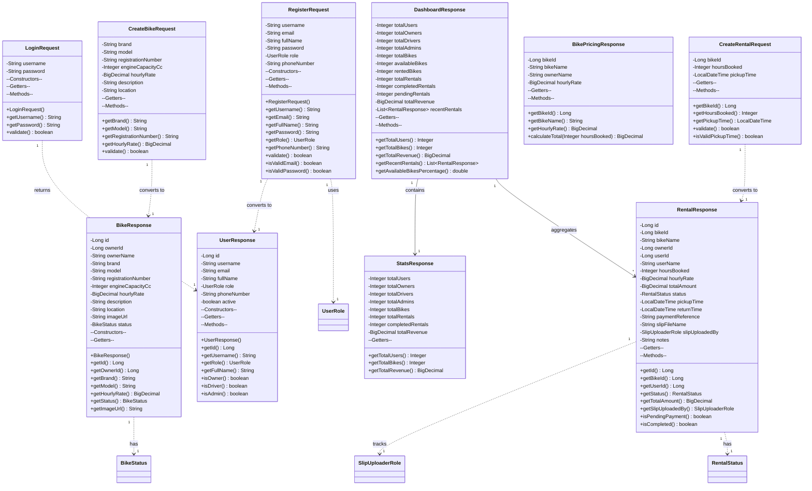
```mermaid
classDiagram
    %% Request DTOs
    class RegisterRequest {
        -String username
        -String email
        -String fullName
        -String password
        -UserRole role
        -String phoneNumber
        --Constructors--
        +RegisterRequest()
        --Getters--
        +getUsername() String
        +getEmail() String
        +getFullName() String
        +getPassword() String
        +getRole() UserRole
        +getPhoneNumber() String
        --Methods--
        +validate() boolean
        +isValidEmail() boolean
        +isValidPassword() boolean
    }
    
    class LoginRequest {
        -String username
        -String password
        --Constructors--
        +LoginRequest()
        --Getters--
        +getUsername() String
        +getPassword() String
        --Methods--
        +validate() boolean
    }
    
    class CreateBikeRequest {
        -String brand
        -String model
        -String registrationNumber
        -Integer engineCapacityCc
        -BigDecimal hourlyRate
        -String description
        -String location
        --Getters--
        +getBrand() String
        +getModel() String
        +getRegistrationNumber() String
        +getHourlyRate() BigDecimal
        --Methods--
        +validate() boolean
    }
    
    class CreateRentalRequest {
        -Long bikeId
        -Integer hoursBooked
        -LocalDateTime pickupTime
        --Getters--
        +getBikeId() Long
        +getHoursBooked() Integer
        +getPickupTime() LocalDateTime
        --Methods--
        +validate() boolean
        +isValidPickupTime() boolean
    }
    
    %% Response DTOs
    class UserResponse {
        -Long id
        -String username
        -String email
        -String fullName
        -UserRole role
        -String phoneNumber
        -boolean active
        --Constructors--
        +UserResponse()
        --Getters--
        +getId() Long
        +getUsername() String
        +getRole() UserRole
        +getFullName() String
        --Methods--
        +isOwner() boolean
        +isDriver() boolean
        +isAdmin() boolean
    }
    
    class BikeResponse {
        -Long id
        -Long ownerId
        -String ownerName
        -String brand
        -String model
        -String registrationNumber
        -Integer engineCapacityCc
        -BigDecimal hourlyRate
        -String description
        -String location
        -String imageUrl
        -BikeStatus status
        --Constructors--
        +BikeResponse()
        --Getters--
        +getId() Long
        +getOwnerId() Long
        +getBrand() String
        +getModel() String
        +getHourlyRate() BigDecimal
        +getStatus() BikeStatus
        +getImageUrl() String
    }
    
    class BikePricingResponse {
        -Long bikeId
        -String bikeName
        -String ownerName
        -BigDecimal hourlyRate
        --Getters--
        +getBikeId() Long
        +getBikeName() String
        +getHourlyRate() BigDecimal
        --Methods--
        +calculateTotal(Integer hoursBooked) BigDecimal
    }
    
    class RentalResponse {
        -Long id
        -Long bikeId
        -String bikeName
        -Long ownerId
        -Long userId
        -String userName
        -Integer hoursBooked
        -BigDecimal hourlyRate
        -BigDecimal totalAmount
        -RentalStatus status
        -LocalDateTime pickupTime
        -LocalDateTime returnTime
        -String paymentReference
        -String slipFileName
        -SlipUploaderRole slipUploadedBy
        -String notes
        --Getters--
        +getId() Long
        +getBikeId() Long
        +getUserId() Long
        +getStatus() RentalStatus
        +getTotalAmount() BigDecimal
        +getSlipUploadedBy() SlipUploaderRole
        --Methods--
        +isPendingPayment() boolean
        +isCompleted() boolean
    }
    
    class DashboardResponse {
        -Integer totalUsers
        -Integer totalOwners
        -Integer totalDrivers
        -Integer totalAdmins
        -Integer totalBikes
        -Integer availableBikes
        -Integer rentedBikes
        -Integer totalRentals
        -Integer completedRentals
        -Integer pendingRentals
        -BigDecimal totalRevenue
        -List~RentalResponse~ recentRentals
        --Getters--
        +getTotalUsers() Integer
        +getTotalBikes() Integer
        +getTotalRevenue() BigDecimal
        +getRecentRentals() List~RentalResponse~
        --Methods--
        +getAvailableBikesPercentage() double
    }
    
    class StatsResponse {
        -Integer totalUsers
        -Integer totalOwners
        -Integer totalDrivers
        -Integer totalAdmins
        -Integer totalBikes
        -Integer totalRentals
        -Integer completedRentals
        -BigDecimal totalRevenue
        --Getters--
        +getTotalUsers() Integer
        +getTotalBikes() Integer
        +getTotalRevenue() BigDecimal
    }
    
    %% Relationships - Dependency (dashed)
    RegisterRequest "1" ..> "1" UserRole : uses
    RegisterRequest "1" ..> "1" UserResponse : converts to
    LoginRequest "1" ..> "1" UserResponse : returns
    CreateBikeRequest "1" ..> "1" BikeResponse : converts to
    CreateRentalRequest "1" ..> "1" RentalResponse : converts to
    BikeResponse "1" ..> "1" BikeStatus : has
    RentalResponse "1" ..> "1" RentalStatus : has
    RentalResponse "1" ..> "1" SlipUploaderRole : tracks
    DashboardResponse "1" --> "*" RentalResponse : aggregates
    DashboardResponse "1" --> "1" StatsResponse : contains
```

### 6. Complete Domain Model - Cross-Service Relationships

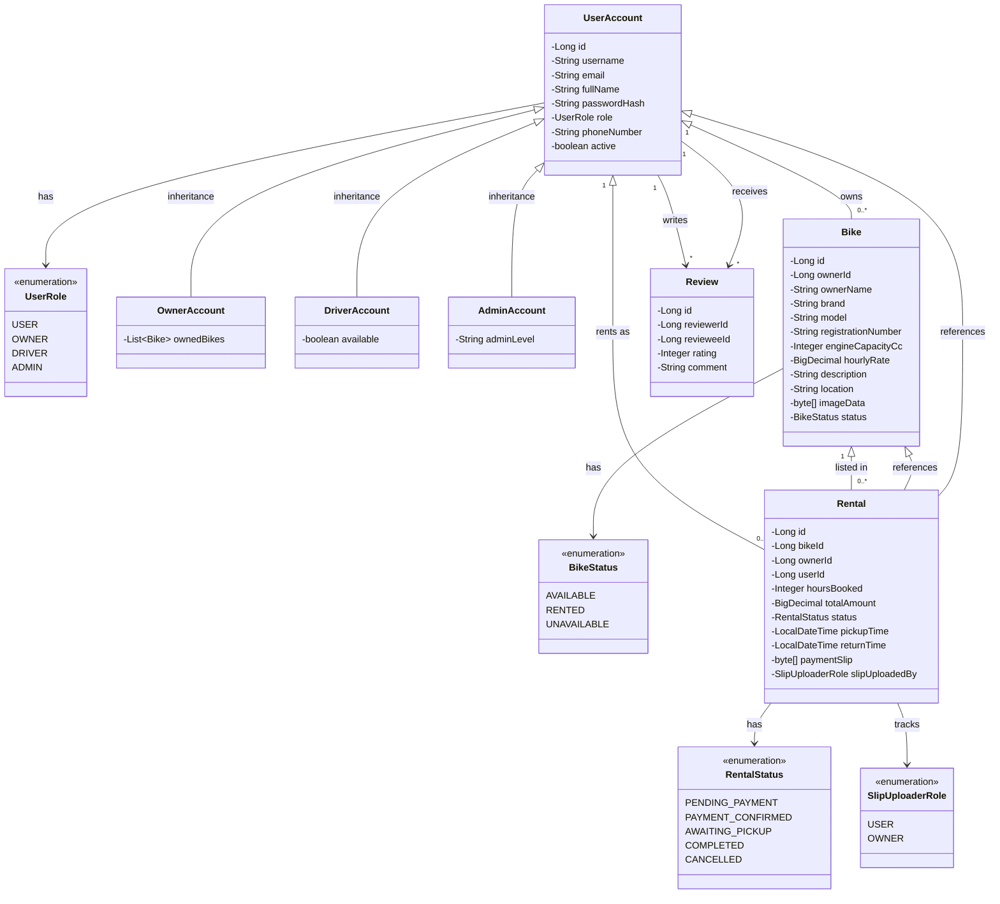
```mermaid
classDiagram
    %% ============ ENUMERATIONS ============
    class UserRole {
        <<enumeration>>
        USER
        OWNER
        DRIVER
        ADMIN
    }
    
    class BikeStatus {
        <<enumeration>>
        AVAILABLE
        RENTED
        UNAVAILABLE
    }
    
    class RentalStatus {
        <<enumeration>>
        PENDING_PAYMENT
        PAYMENT_CONFIRMED
        AWAITING_PICKUP
        COMPLETED
        CANCELLED
    }
    
    class SlipUploaderRole {
        <<enumeration>>
        USER
        OWNER
    }
    
    %% ============ DOMAIN ENTITIES ============
    
    %% UserAccount Hierarchy
    class UserAccount {
        -Long id
        -String username
        -String email
        -String fullName
        -String passwordHash
        -UserRole role
        -String phoneNumber
        -boolean active
    }
    
    class OwnerAccount {
        -List~Bike~ ownedBikes
    }
    
    class DriverAccount {
        -boolean available
    }
    
    class AdminAccount {
        -String adminLevel
    }
    
    %% Bike and Rental Classes
    class Bike {
        -Long id
        -Long ownerId
        -String ownerName
        -String brand
        -String model
        -String registrationNumber
        -Integer engineCapacityCc
        -BigDecimal hourlyRate
        -String description
        -String location
        -byte[] imageData
        -BikeStatus status
    }
    
    class Rental {
        -Long id
        -Long bikeId
        -Long ownerId
        -Long userId
        -Integer hoursBooked
        -BigDecimal totalAmount
        -RentalStatus status
        -LocalDateTime pickupTime
        -LocalDateTime returnTime
        -byte[] paymentSlip
        -SlipUploaderRole slipUploadedBy
    }
    
    class Review {
        -Long id
        -Long reviewerId
        -Long revieweeId
        -Integer rating
        -String comment
    }
    
    %% ============ RELATIONSHIPS ============
    
    %% Inheritance
    UserAccount <|-- OwnerAccount : inheritance
    UserAccount <|-- DriverAccount : inheritance
    UserAccount <|-- AdminAccount : inheritance
    
    %% User to Bike (Owner has Bikes)
    UserAccount "1" <|-- "0..*" Bike : owns
    
    %% User to Rental
    UserAccount "1" <|-- "0..*" Rental : rents as
    
    %% Bike to Rental
    Bike "1" <|-- "0..*" Rental : listed in
    
    %% Reviews (Association)
    UserAccount "1" --> "*" Review : writes
    UserAccount "1" --> "*" Review : receives
    
    %% Enums
    UserAccount --> UserRole : has
    Bike --> BikeStatus : has
    Rental --> RentalStatus : has
    Rental --> SlipUploaderRole : tracks
    
    %% Dependencies
    Rental --|> Bike : references
    Rental --|> UserAccount : references
```

### 7. Controller and REST API Layer


```mermaid
classDiagram
    %% ============ CONTROLLERS ============
    
    class AuthController {
        -AuthService authService
        --Endpoints--
        +register(RegisterRequest) ResponseEntity~UserResponse~
        +login(LoginRequest) ResponseEntity~UserResponse~
        +getAllUsers() ResponseEntity~List~UserResponse~~
        +getStats() ResponseEntity~StatsResponse~
        --Helper Methods--
        -validateRequest(RegisterRequest) void
        -handleAuthException(Exception) ResponseEntity
    }
    
    class BikeController {
        -BikeService bikeService
        --Endpoints--
        +createBike(CreateBikeRequest, MultipartFile) ResponseEntity~BikeResponse~
        +getAvailableBikes() ResponseEntity~List~BikeResponse~~
        +getOwnerBikes(Long ownerId) ResponseEntity~List~BikeResponse~~
        +getPricing(Long bikeId) ResponseEntity~BikePricingResponse~
        +getBikeImage(Long bikeId) ResponseEntity~Resource~
        +updateBikeStatus(Long bikeId, BikeStatus) ResponseEntity~BikeResponse~
        --Helper Methods--
        -validateCreateBikeRequest(CreateBikeRequest) void
        -handleBikeException(Exception) ResponseEntity
    }
    
    class RentalController {
        -RentalService rentalService
        --Endpoints--
        +createRental(CreateRentalRequest) ResponseEntity~RentalResponse~
        +uploadPaymentSlip(Long, MultipartFile, SlipUploaderRole) ResponseEntity~void~
        +deletePaymentSlip(Long) ResponseEntity~void~
        +updateRentalStatus(Long, RentalStatus, String) ResponseEntity~RentalResponse~
        +getUserRentals(Long userId) ResponseEntity~List~RentalResponse~~
        +getOwnerRentals(Long ownerId) ResponseEntity~List~RentalResponse~~
        +getAllRentals() ResponseEntity~List~RentalResponse~~
        +getPaymentSlip(Long rentalId) ResponseEntity~Resource~
        +getRentalStats() ResponseEntity~StatsResponse~
        --Helper Methods--
        -validateCreateRentalRequest(CreateRentalRequest) void
        -handleRentalException(Exception) ResponseEntity
    }
    
    class AdminController {
        -AdminService adminService
        --Endpoints--
        +getDashboard() ResponseEntity~DashboardResponse~
        +viewAllUsers() ResponseEntity~List~UserResponse~~
        +viewAllBikes() ResponseEntity~List~BikeResponse~~
        +viewAllRentals() ResponseEntity~List~RentalResponse~~
        --Helper Methods--
        -aggregateDashboardData() DashboardResponse
    }
    
    class GatewayController {
        <<Spring Cloud Gateway>>
        --Routing Rules--
        +routeToAuthService() Route
        +routeToBikeService() Route
        +routeToRentalService() Route
        +routeToAdminService() Route
        --Filters--
        -applyPreFilters() void
        -applyPostFilters() void
    }
    
    %% ============ EXCEPTION HANDLERS ============
    
    class GlobalExceptionHandler {
        <<@ControllerAdvice>>
        -ResponseEntity~ErrorResponse~ handleValidationException()
        -ResponseEntity~ErrorResponse~ handleResourceNotFoundException()
        -ResponseEntity~ErrorResponse~ handleConflictException()
        -ResponseEntity~ErrorResponse~ handleAuthenticationException()
        -ResponseEntity~ErrorResponse~ handleGeneralException()
    }
    
    class ErrorResponse {
        -String message
        -String errorCode
        -int statusCode
        -LocalDateTime timestamp
    }
    
    %% ============ RELATIONSHIPS ============
    
    %% Controllers to Services (Composition - contains)
    AuthController "1" *-- "1" AuthService : contains
    BikeController "1" *-- "1" BikeService : contains
    RentalController "1" *-- "1" RentalService : contains
    AdminController "1" *-- "1" AdminService : contains
    GatewayController "1" *-- "4" Route : routes
    
    %% Controllers to DTOs (Dependency - uses)
    AuthController "1" ..> "1" RegisterRequest : uses
    AuthController "1" ..> "1" LoginRequest : uses
    AuthController "1" ..> "1" UserResponse : returns
    BikeController "1" ..> "1" CreateBikeRequest : uses
    BikeController "1" ..> "1" BikeResponse : returns
    BikeController "1" ..> "1" BikePricingResponse : returns
    RentalController "1" ..> "1" CreateRentalRequest : uses
    RentalController "1" ..> "1" RentalResponse : returns
    AdminController "1" ..> "1" DashboardResponse : returns
    
    %% Exception Handler
    GlobalExceptionHandler "1" ..> "*" ErrorResponse : creates
    AuthController --|> GlobalExceptionHandler : uses
    BikeController --|> GlobalExceptionHandler : uses
    RentalController --|> GlobalExceptionHandler : uses
    AdminController --|> GlobalExceptionHandler : uses
```

---

## Sequence Diagrams

### 1. User Registration and Login Flow

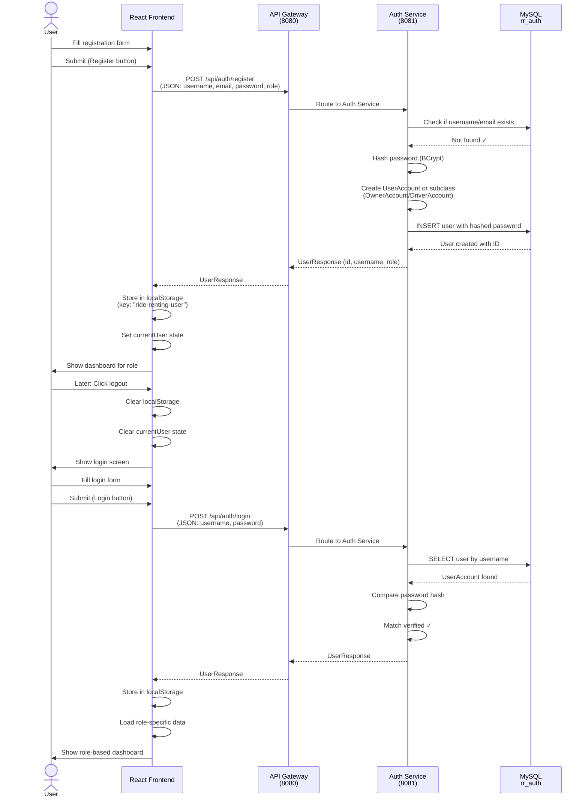
```mermaid
sequenceDiagram
    actor User as User
    participant Frontend as React Frontend
    participant Gateway as API Gateway<br/>(8080)
    participant AuthSvc as Auth Service<br/>(8081)
    participant DB as MySQL<br/>rr_auth

    User->>Frontend: Fill registration form
    User->>Frontend: Submit (Register button)
    
    Frontend->>Gateway: POST /api/auth/register<br/>(JSON: username, email, password, role)
    Gateway->>AuthSvc: Route to Auth Service
    
    AuthSvc->>DB: Check if username/email exists
    DB-->>AuthSvc: Not found ✓
    
    AuthSvc->>AuthSvc: Hash password (BCrypt)
    AuthSvc->>AuthSvc: Create UserAccount or subclass<br/>(OwnerAccount/DriverAccount)
    
    AuthSvc->>DB: INSERT user with hashed password
    DB-->>AuthSvc: User created with ID
    
    AuthSvc-->>Gateway: UserResponse (id, username, role)
    Gateway-->>Frontend: UserResponse
    
    Frontend->>Frontend: Store in localStorage<br/>(key: "ride-renting-user")
    Frontend->>Frontend: Set currentUser state
    Frontend->>User: Show dashboard for role
    
    User->>Frontend: Later: Click logout
    Frontend->>Frontend: Clear localStorage
    Frontend->>Frontend: Clear currentUser state
    Frontend->>User: Show login screen
    
    User->>Frontend: Fill login form
    User->>Frontend: Submit (Login button)
    
    Frontend->>Gateway: POST /api/auth/login<br/>(JSON: username, password)
    Gateway->>AuthSvc: Route to Auth Service
    
    AuthSvc->>DB: SELECT user by username
    DB-->>AuthSvc: UserAccount found
    
    AuthSvc->>AuthSvc: Compare password hash
    AuthSvc->>AuthSvc: Match verified ✓
    
    AuthSvc-->>Gateway: UserResponse
    Gateway-->>Frontend: UserResponse
    
    Frontend->>Frontend: Store in localStorage
    Frontend->>Frontend: Load role-specific data
    Frontend->>User: Show role-based dashboard
```

### 2. Bike Creation and Listing Flow

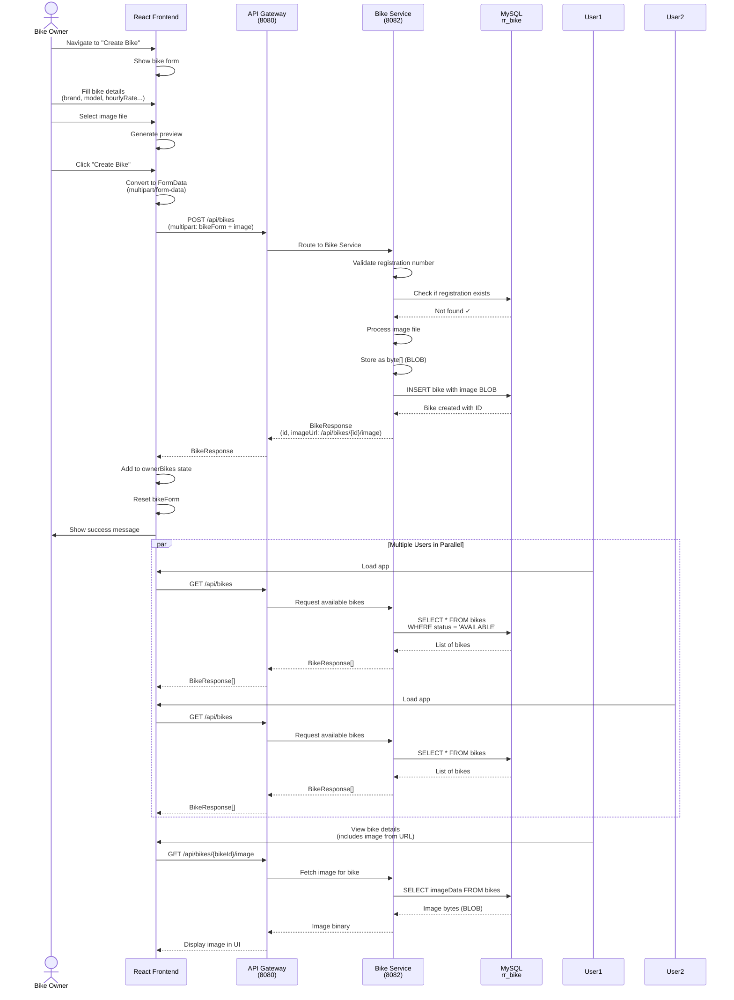
```mermaid
sequenceDiagram
    actor Owner as Bike Owner
    participant Frontend as React Frontend
    participant Gateway as API Gateway<br/>(8080)
    participant BikeSvc as Bike Service<br/>(8082)
    participant DB as MySQL<br/>rr_bike

    Owner->>Frontend: Navigate to "Create Bike"
    Frontend->>Frontend: Show bike form
    
    Owner->>Frontend: Fill bike details<br/>(brand, model, hourlyRate...)
    Owner->>Frontend: Select image file
    Frontend->>Frontend: Generate preview
    
    Owner->>Frontend: Click "Create Bike"
    Frontend->>Frontend: Convert to FormData<br/>(multipart/form-data)
    
    Frontend->>Gateway: POST /api/bikes<br/>(multipart: bikeForm + image)
    Gateway->>BikeSvc: Route to Bike Service
    
    BikeSvc->>BikeSvc: Validate registration number
    BikeSvc->>DB: Check if registration exists
    DB-->>BikeSvc: Not found ✓
    
    BikeSvc->>BikeSvc: Process image file
    BikeSvc->>BikeSvc: Store as byte[] (BLOB)
    
    BikeSvc->>DB: INSERT bike with image BLOB
    DB-->>BikeSvc: Bike created with ID
    
    BikeSvc-->>Gateway: BikeResponse<br/>(id, imageUrl: /api/bikes/{id}/image)
    Gateway-->>Frontend: BikeResponse
    
    Frontend->>Frontend: Add to ownerBikes state
    Frontend->>Frontend: Reset bikeForm
    Frontend->>Owner: Show success message
    
    par Multiple Users in Parallel
        User1->>Frontend: Load app
        Frontend->>Gateway: GET /api/bikes
        Gateway->>BikeSvc: Request available bikes
        BikeSvc->>DB: SELECT * FROM bikes<br/>WHERE status = 'AVAILABLE'
        DB-->>BikeSvc: List of bikes
        BikeSvc-->>Gateway: BikeResponse[]
        Gateway-->>Frontend: BikeResponse[]
        
        User2->>Frontend: Load app
        Frontend->>Gateway: GET /api/bikes
        Gateway->>BikeSvc: Request available bikes
        BikeSvc->>DB: SELECT * FROM bikes
        DB-->>BikeSvc: List of bikes
        BikeSvc-->>Gateway: BikeResponse[]
        Gateway-->>Frontend: BikeResponse[]
    end
    
    User1->>Frontend: View bike details<br/>(includes image from URL)
    Frontend->>Gateway: GET /api/bikes/{bikeId}/image
    Gateway->>BikeSvc: Fetch image for bike
    BikeSvc->>DB: SELECT imageData FROM bikes
    DB-->>BikeSvc: Image bytes (BLOB)
    BikeSvc-->>Gateway: Image binary
    Gateway-->>Frontend: Display image in UI
```

### 3. Rental Creation and Payment Flow

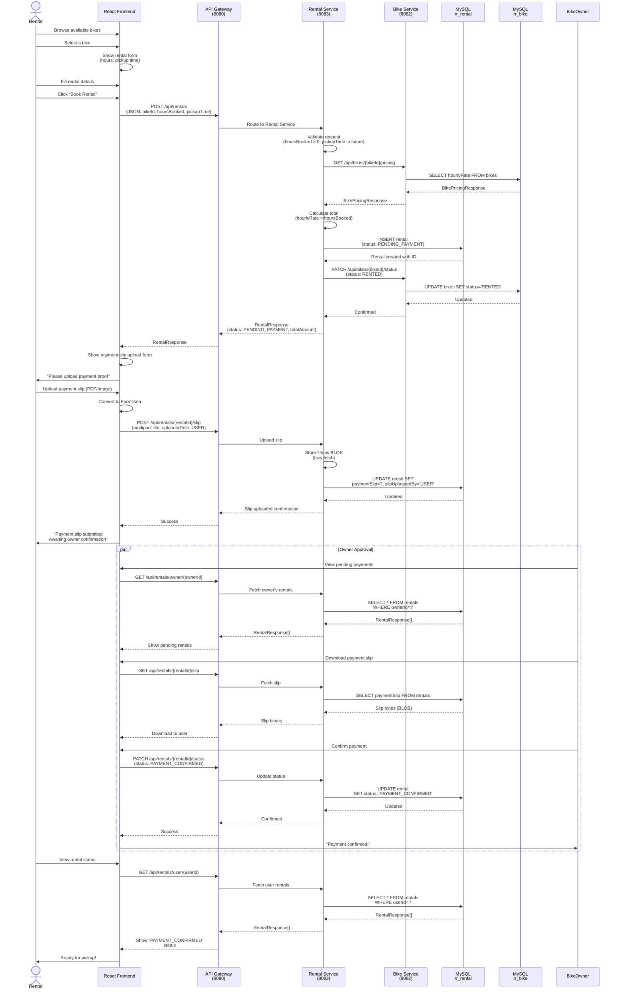
```mermaid
sequenceDiagram
    actor User as Renter
    participant Frontend as React Frontend
    participant Gateway as API Gateway<br/>(8080)
    participant RentalSvc as Rental Service<br/>(8083)
    participant BikeSvc as Bike Service<br/>(8082)
    participant DB_Rental as MySQL<br/>rr_rental
    participant DB_Bike as MySQL<br/>rr_bike

    User->>Frontend: Browse available bikes
    User->>Frontend: Select a bike
    Frontend->>Frontend: Show rental form<br/>(hours, pickup time)
    
    User->>Frontend: Fill rental details
    User->>Frontend: Click "Book Rental"
    
    Frontend->>Gateway: POST /api/rentals<br/>(JSON: bikeId, hoursBooked, pickupTime)
    Gateway->>RentalSvc: Route to Rental Service
    
    RentalSvc->>RentalSvc: Validate request<br/>(hoursBooked > 0, pickupTime in future)
    
    RentalSvc->>BikeSvc: GET /api/bikes/{bikeId}/pricing
    BikeSvc->>DB_Bike: SELECT hourlyRate FROM bikes
    DB_Bike-->>BikeSvc: BikePricingResponse
    BikeSvc-->>RentalSvc: BikePricingResponse
    
    RentalSvc->>RentalSvc: Calculate total<br/>(hourlyRate × hoursBooked)
    
    RentalSvc->>DB_Rental: INSERT rental<br/>(status: PENDING_PAYMENT)
    DB_Rental-->>RentalSvc: Rental created with ID
    
    RentalSvc->>BikeSvc: PATCH /api/bikes/{bikeId}/status<br/>(status: RENTED)
    BikeSvc->>DB_Bike: UPDATE bikes SET status='RENTED'
    DB_Bike-->>BikeSvc: Updated
    BikeSvc-->>RentalSvc: Confirmed
    
    RentalSvc-->>Gateway: RentalResponse<br/>(status: PENDING_PAYMENT, totalAmount)
    Gateway-->>Frontend: RentalResponse
    
    Frontend->>Frontend: Show payment slip upload form
    Frontend->>User: "Please upload payment proof"
    
    User->>Frontend: Upload payment slip (PDF/Image)
    Frontend->>Frontend: Convert to FormData
    
    Frontend->>Gateway: POST /api/rentals/{rentalId}/slip<br/>(multipart: file, uploaderRole: USER)
    Gateway->>RentalSvc: Upload slip
    
    RentalSvc->>RentalSvc: Store file as BLOB<br/>(lazy fetch)
    RentalSvc->>DB_Rental: UPDATE rental SET<br/>paymentSlip=?, slipUploadedBy='USER'
    DB_Rental-->>RentalSvc: Updated
    
    RentalSvc-->>Gateway: Slip uploaded confirmation
    Gateway-->>Frontend: Success
    
    Frontend->>User: "Payment slip submitted<br/>Awaiting owner confirmation"
    
    par Owner Approval
        BikeOwner->>Frontend: View pending payments
        Frontend->>Gateway: GET /api/rentals/owner/{ownerId}
        Gateway->>RentalSvc: Fetch owner's rentals
        RentalSvc->>DB_Rental: SELECT * FROM rentals<br/>WHERE ownerId=?
        DB_Rental-->>RentalSvc: RentalResponse[]
        RentalSvc-->>Gateway: RentalResponse[]
        Gateway-->>Frontend: Show pending rentals
        
        BikeOwner->>Frontend: Download payment slip
        Frontend->>Gateway: GET /api/rentals/{rentalId}/slip
        Gateway->>RentalSvc: Fetch slip
        RentalSvc->>DB_Rental: SELECT paymentSlip FROM rentals
        DB_Rental-->>RentalSvc: Slip bytes (BLOB)
        RentalSvc-->>Gateway: Slip binary
        Gateway-->>Frontend: Download to user
        
        BikeOwner->>Frontend: Confirm payment
        Frontend->>Gateway: PATCH /api/rentals/{rentalId}/status<br/>(status: PAYMENT_CONFIRMED)
        Gateway->>RentalSvc: Update status
        
        RentalSvc->>DB_Rental: UPDATE rental<br/>SET status='PAYMENT_CONFIRMED'
        DB_Rental-->>RentalSvc: Updated
        
        RentalSvc-->>Gateway: Confirmed
        Gateway-->>Frontend: Success
        Frontend->>BikeOwner: "Payment confirmed!"
    end
    
    User->>Frontend: View rental status
    Frontend->>Gateway: GET /api/rentals/user/{userId}
    Gateway->>RentalSvc: Fetch user rentals
    RentalSvc->>DB_Rental: SELECT * FROM rentals<br/>WHERE userId=?
    DB_Rental-->>RentalSvc: RentalResponse[]
    RentalSvc-->>Gateway: RentalResponse[]
    Gateway-->>Frontend: Show "PAYMENT_CONFIRMED"<br/>status
    Frontend->>User: Ready for pickup!
```

### 4. Admin Dashboard Flow

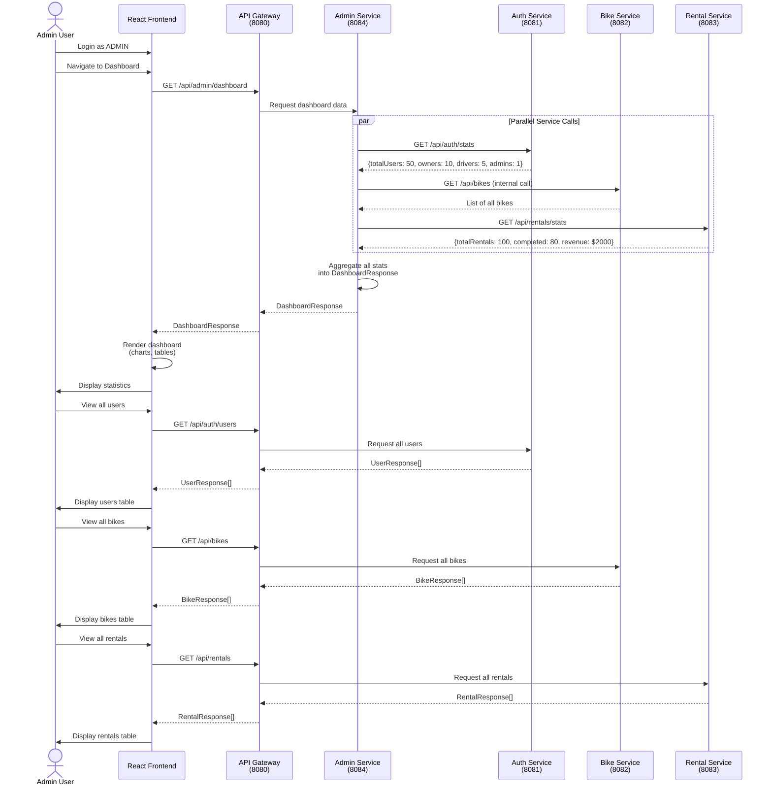
```mermaid
sequenceDiagram
    actor Admin as Admin User
    participant Frontend as React Frontend
    participant Gateway as API Gateway<br/>(8080)
    participant AdminSvc as Admin Service<br/>(8084)
    participant AuthSvc as Auth Service<br/>(8081)
    participant BikeSvc as Bike Service<br/>(8082)
    participant RentalSvc as Rental Service<br/>(8083)

    Admin->>Frontend: Login as ADMIN
    Admin->>Frontend: Navigate to Dashboard
    
    Frontend->>Gateway: GET /api/admin/dashboard
    Gateway->>AdminSvc: Request dashboard data
    
    par Parallel Service Calls
        AdminSvc->>AuthSvc: GET /api/auth/stats
        AuthSvc-->>AdminSvc: {totalUsers: 50, owners: 10, drivers: 5, admins: 1}
        
        AdminSvc->>BikeSvc: GET /api/bikes (internal call)
        BikeSvc-->>AdminSvc: List of all bikes
        
        AdminSvc->>RentalSvc: GET /api/rentals/stats
        RentalSvc-->>AdminSvc: {totalRentals: 100, completed: 80, revenue: $2000}
    end
    
    AdminSvc->>AdminSvc: Aggregate all stats<br/>into DashboardResponse
    
    AdminSvc-->>Gateway: DashboardResponse
    Gateway-->>Frontend: DashboardResponse
    
    Frontend->>Frontend: Render dashboard<br/>(charts, tables)
    Frontend->>Admin: Display statistics
    
    Admin->>Frontend: View all users
    Frontend->>Gateway: GET /api/auth/users
    Gateway->>AuthSvc: Request all users
    AuthSvc-->>Gateway: UserResponse[]
    Gateway-->>Frontend: UserResponse[]
    Frontend->>Admin: Display users table
    
    Admin->>Frontend: View all bikes
    Frontend->>Gateway: GET /api/bikes
    Gateway->>BikeSvc: Request all bikes
    BikeSvc-->>Gateway: BikeResponse[]
    Gateway-->>Frontend: BikeResponse[]
    Frontend->>Admin: Display bikes table
    
    Admin->>Frontend: View all rentals
    Frontend->>Gateway: GET /api/rentals
    Gateway->>RentalSvc: Request all rentals
    RentalSvc-->>Gateway: RentalResponse[]
    Gateway-->>Frontend: RentalResponse[]
    Frontend->>Admin: Display rentals table
```

---

## Component Diagram

### Microservices Architecture

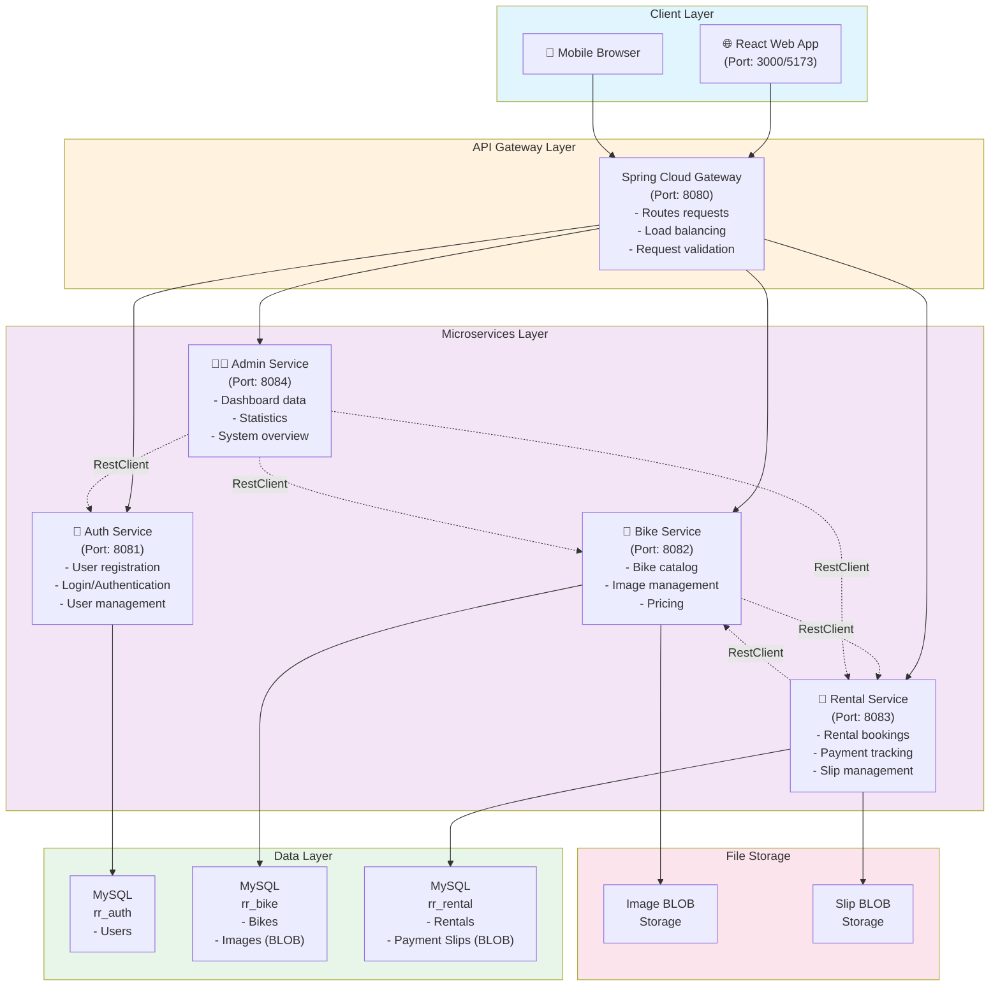
```mermaid
graph TB
    subgraph Client["Client Layer"]
        WEB["🌐 React Web App<br/>(Port: 3000/5173)"]
        MOBILE["📱 Mobile Browser"]
    end
    
    subgraph Gateway["API Gateway Layer"]
        GW["Spring Cloud Gateway<br/>(Port: 8080)<br/>- Routes requests<br/>- Load balancing<br/>- Request validation"]
    end
    
    subgraph Services["Microservices Layer"]
        AUTH["🔐 Auth Service<br/>(Port: 8081)<br/>- User registration<br/>- Login/Authentication<br/>- User management"]
        BIKE["🚗 Bike Service<br/>(Port: 8082)<br/>- Bike catalog<br/>- Image management<br/>- Pricing"]
        RENTAL["📅 Rental Service<br/>(Port: 8083)<br/>- Rental bookings<br/>- Payment tracking<br/>- Slip management"]
        ADMIN["👨‍💼 Admin Service<br/>(Port: 8084)<br/>- Dashboard data<br/>- Statistics<br/>- System overview"]
    end
    
    subgraph Database["Data Layer"]
        AUTHDB["MySQL<br/>rr_auth<br/>- Users"]
        BIKEDB["MySQL<br/>rr_bike<br/>- Bikes<br/>- Images (BLOB)"]
        RENTALDB["MySQL<br/>rr_rental<br/>- Rentals<br/>- Payment Slips (BLOB)"]
    end
    
    subgraph Storage["File Storage"]
        IMGS["Image BLOB<br/>Storage"]
        SLIPS["Slip BLOB<br/>Storage"]
    end
    
    WEB --> GW
    MOBILE --> GW
    
    GW --> AUTH
    GW --> BIKE
    GW --> RENTAL
    GW --> ADMIN
    
    AUTH --> AUTHDB
    BIKE --> BIKEDB
    RENTAL --> RENTALDB
    
    BIKE -.->|RestClient| RENTAL
    RENTAL -.->|RestClient| BIKE
    ADMIN -.->|RestClient| AUTH
    ADMIN -.->|RestClient| BIKE
    ADMIN -.->|RestClient| RENTAL
    
    BIKE --> IMGS
    RENTAL --> SLIPS
    
    style Client fill:#e1f5ff
    style Gateway fill:#fff3e0
    style Services fill:#f3e5f5
    style Database fill:#e8f5e9
    style Storage fill:#fce4ec
```

---

## Entity-Relationship Diagram

### Database Schema

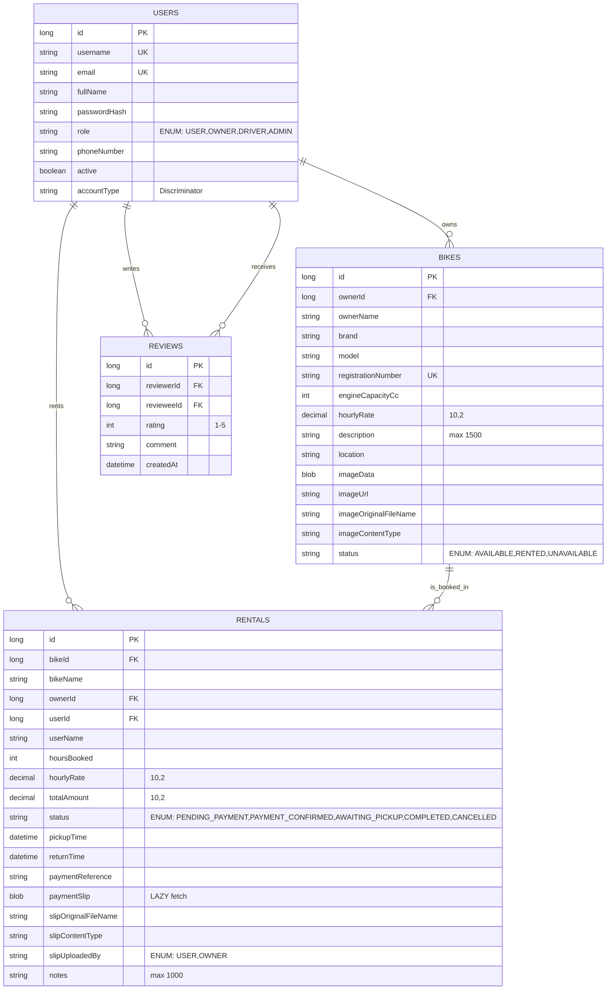
```mermaid
erDiagram
    USERS ||--o{ BIKES : "owns"
    USERS ||--o{ RENTALS : "rents"
    BIKES ||--o{ RENTALS : "is_booked_in"
    USERS ||--o{ REVIEWS : "writes"
    USERS ||--o{ REVIEWS : "receives"
    
    USERS {
        long id PK
        string username UK
        string email UK
        string fullName
        string passwordHash
        string role "ENUM: USER,OWNER,DRIVER,ADMIN"
        string phoneNumber
        boolean active
        string accountType "Discriminator"
    }
    
    BIKES {
        long id PK
        long ownerId FK
        string ownerName
        string brand
        string model
        string registrationNumber UK
        int engineCapacityCc
        decimal hourlyRate "10,2"
        string description "max 1500"
        string location
        blob imageData
        string imageUrl
        string imageOriginalFileName
        string imageContentType
        string status "ENUM: AVAILABLE,RENTED,UNAVAILABLE"
    }
    
    RENTALS {
        long id PK
        long bikeId FK
        string bikeName
        long ownerId FK
        long userId FK
        string userName
        int hoursBooked
        decimal hourlyRate "10,2"
        decimal totalAmount "10,2"
        string status "ENUM: PENDING_PAYMENT,PAYMENT_CONFIRMED,AWAITING_PICKUP,COMPLETED,CANCELLED"
        datetime pickupTime
        datetime returnTime
        string paymentReference
        blob paymentSlip "LAZY fetch"
        string slipOriginalFileName
        string slipContentType
        string slipUploadedBy "ENUM: USER,OWNER"
        string notes "max 1000"
    }
    
    REVIEWS {
        long id PK
        long reviewerId FK
        long revieweeId FK
        int rating "1-5"
        string comment
        datetime createdAt
    }
```

---

## Use Case Diagram

### System Use Cases


```mermaid
graph TB
    subgraph Users["User Roles"]
        U["👤 Regular User"]
        O["🏪 Bike Owner"]
        D["🚙 Driver"]
        A["👨‍💼 Admin"]
    end
    
    subgraph AuthUseCases["Authentication"]
        REG["Register Account"]
        LOGIN["Login"]
        LOGOUT["Logout"]
        PROFILE["Manage Profile"]
    end
    
    subgraph BikeUseCases["Bike Management"]
        BROWSE["Browse Bikes"]
        CREATE_BIKE["Create Bike Listing"]
        MANAGE_BIKE["Manage Bike"]
        UPLOAD_IMG["Upload Bike Image"]
    end
    
    subgraph RentalUseCases["Rental Operations"]
        CREATE_RENTAL["Create Rental"]
        UPLOAD_SLIP["Upload Payment Slip"]
        VIEW_RENTAL["View Rental Status"]
        CONFIRM_PAYMENT["Confirm Payment"]
        CANCEL_RENTAL["Cancel Rental"]
    end
    
    subgraph RideShareUseCases["Ride-Sharing"]
        REQUEST_RIDE["Request Ride"]
        OFFER_RIDE["Offer Ride Service"]
        SET_AVAILABILITY["Set Availability"]
    end
    
    subgraph AdminUseCases["Admin Functions"]
        VIEW_DASHBOARD["View Dashboard"]
        VIEW_USERS["View All Users"]
        VIEW_BIKES["View All Bikes"]
        VIEW_RENTALS["View All Rentals"]
    end
    
    subgraph ReviewUseCases["Reviews"]
        WRITE_REVIEW["Write Review"]
        VIEW_REVIEWS["View Reviews"]
    end
    
    U --> REG
    U --> LOGIN
    U --> LOGOUT
    U --> PROFILE
    U --> BROWSE
    U --> CREATE_RENTAL
    U --> UPLOAD_SLIP
    U --> VIEW_RENTAL
    U --> CANCEL_RENTAL
    U --> REQUEST_RIDE
    U --> WRITE_REVIEW
    U --> VIEW_REVIEWS
    
    O --> LOGIN
    O --> LOGOUT
    O --> PROFILE
    O --> BROWSE
    O --> CREATE_BIKE
    O --> MANAGE_BIKE
    O --> UPLOAD_IMG
    O --> CONFIRM_PAYMENT
    O --> VIEW_RENTAL
    O --> WRITE_REVIEW
    O --> VIEW_REVIEWS
    
    D --> LOGIN
    D --> LOGOUT
    D --> PROFILE
    D --> OFFER_RIDE
    D --> SET_AVAILABILITY
    D --> WRITE_REVIEW
    D --> VIEW_REVIEWS
    
    A --> LOGIN
    A --> LOGOUT
    A --> VIEW_DASHBOARD
    A --> VIEW_USERS
    A --> VIEW_BIKES
    A --> VIEW_RENTALS
    A --> VIEW_REVIEWS
    
    style Users fill:#e3f2fd
    style AuthUseCases fill:#fff3e0
    style BikeUseCases fill:#f3e5f5
    style RentalUseCases fill:#e8f5e9
    style RideShareUseCases fill:#fce4ec
    style AdminUseCases fill:#ffe0b2
    style ReviewUseCases fill:#f1f8e9
```

---

## State Diagrams

### 1. Rental Status State Machine

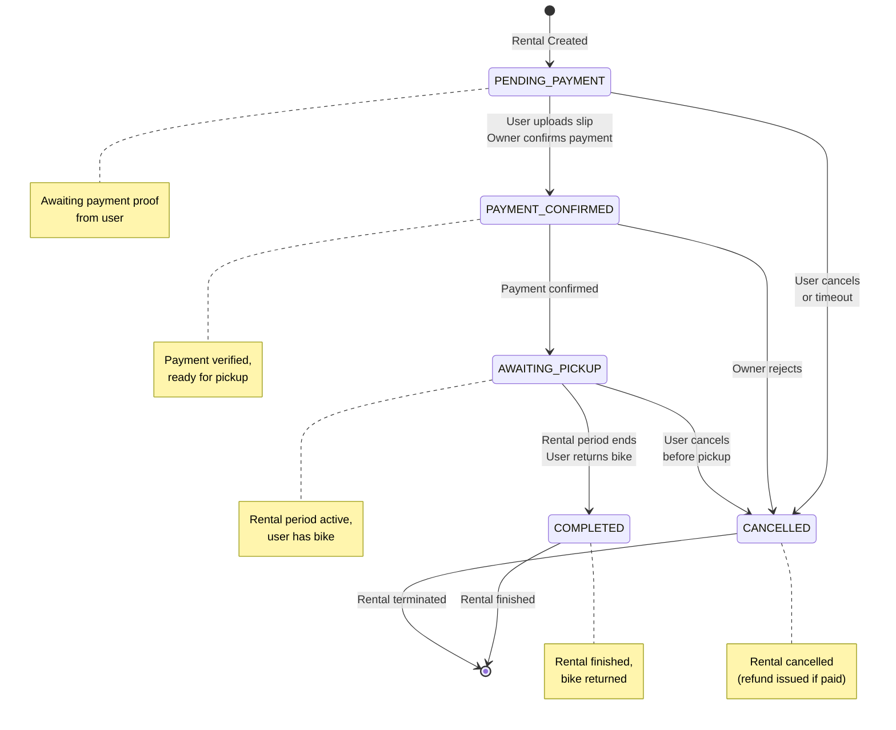
```mermaid
stateDiagram-v2
    [*] --> PENDING_PAYMENT: Rental Created
    
    PENDING_PAYMENT --> PAYMENT_CONFIRMED: User uploads slip<br/>Owner confirms payment
    PENDING_PAYMENT --> CANCELLED: User cancels<br/>or timeout
    
    PAYMENT_CONFIRMED --> AWAITING_PICKUP: Payment confirmed
    PAYMENT_CONFIRMED --> CANCELLED: Owner rejects
    
    AWAITING_PICKUP --> COMPLETED: Rental period ends<br/>User returns bike
    AWAITING_PICKUP --> CANCELLED: User cancels<br/>before pickup
    
    COMPLETED --> [*]: Rental finished
    CANCELLED --> [*]: Rental terminated
    
    note right of PENDING_PAYMENT
        Awaiting payment proof
        from user
    end note
    
    note right of PAYMENT_CONFIRMED
        Payment verified,
        ready for pickup
    end note
    
    note right of AWAITING_PICKUP
        Rental period active,
        user has bike
    end note
    
    note right of COMPLETED
        Rental finished,
        bike returned
    end note
    
    note right of CANCELLED
        Rental cancelled
        (refund issued if paid)
    end note
```

### 2. Bike Status State Machine

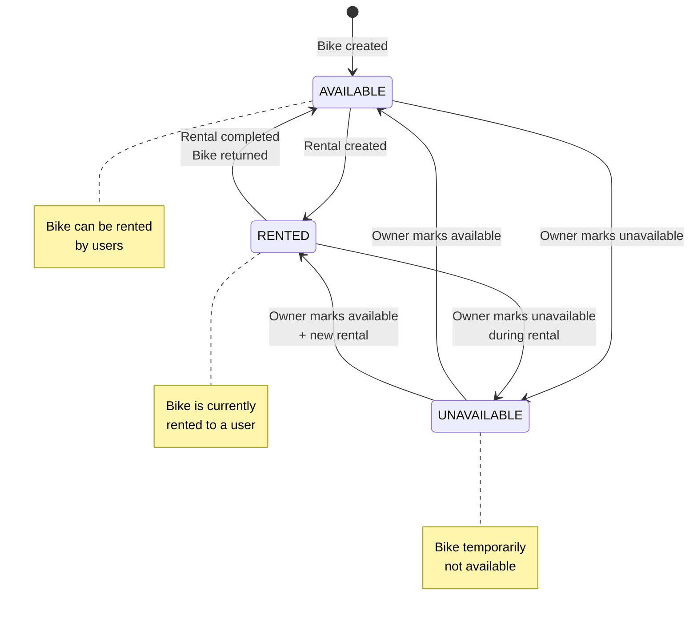
```mermaid
stateDiagram-v2
    [*] --> AVAILABLE: Bike created
    
    AVAILABLE --> RENTED: Rental created
    AVAILABLE --> UNAVAILABLE: Owner marks unavailable
    
    RENTED --> AVAILABLE: Rental completed<br/>Bike returned
    RENTED --> UNAVAILABLE: Owner marks unavailable<br/>during rental
    
    UNAVAILABLE --> AVAILABLE: Owner marks available
    UNAVAILABLE --> RENTED: Owner marks available<br/>+ new rental
    
    note right of AVAILABLE
        Bike can be rented
        by users
    end note
    
    note right of RENTED
        Bike is currently
        rented to a user
    end note
    
    note right of UNAVAILABLE
        Bike temporarily
        not available
    end note
```

### 3. User Authentication State Machine

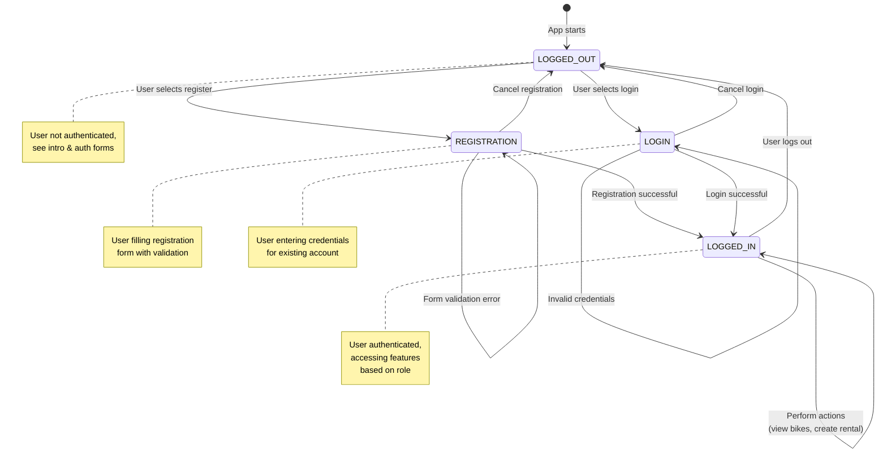
```mermaid
stateDiagram-v2
    [*] --> LOGGED_OUT: App starts
    
    LOGGED_OUT --> REGISTRATION: User selects register
    LOGGED_OUT --> LOGIN: User selects login
    
    REGISTRATION --> REGISTRATION: Form validation error
    REGISTRATION --> LOGGED_IN: Registration successful
    REGISTRATION --> LOGGED_OUT: Cancel registration
    
    LOGIN --> LOGIN: Invalid credentials
    LOGIN --> LOGGED_IN: Login successful
    LOGIN --> LOGGED_OUT: Cancel login
    
    LOGGED_IN --> LOGGED_IN: Perform actions<br/>(view bikes, create rental)
    LOGGED_IN --> LOGGED_OUT: User logs out
    
    note right of LOGGED_OUT
        User not authenticated,
        see intro & auth forms
    end note
    
    note right of REGISTRATION
        User filling registration
        form with validation
    end note
    
    note right of LOGIN
        User entering credentials
        for existing account
    end note
    
    note right of LOGGED_IN
        User authenticated,
        accessing features
        based on role
    end note
```

---

## Deployment Diagram

### System Deployment Architecture

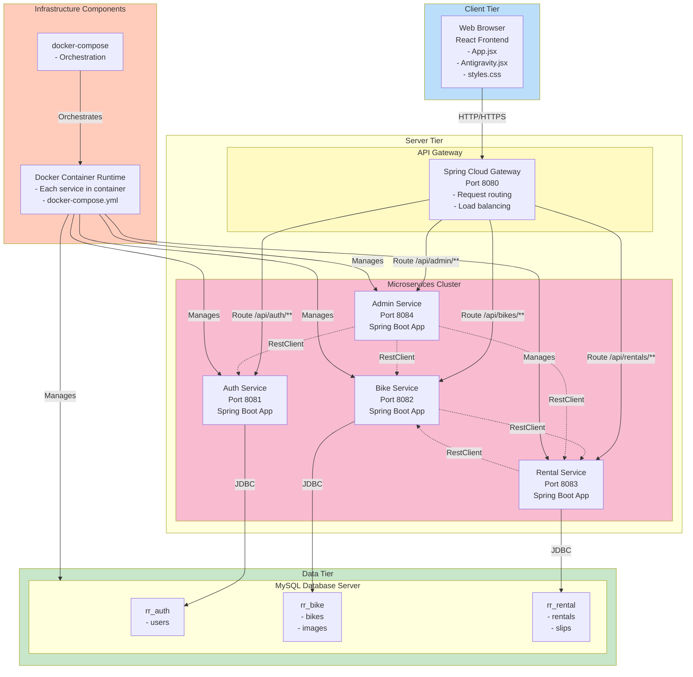
```mermaid
graph TB
    subgraph Client["Client Tier"]
        BROWSER["Web Browser<br/>React Frontend<br/>- App.jsx<br/>- Antigravity.jsx<br/>- styles.css"]
    end
    
    subgraph Server["Server Tier"]
        subgraph Gateway["API Gateway"]
            NGAPI["Spring Cloud Gateway<br/>Port 8080<br/>- Request routing<br/>- Load balancing"]
        end
        
        subgraph MicroServices["Microservices Cluster"]
            AUTH_APP["Auth Service<br/>Port 8081<br/>Spring Boot App"]
            BIKE_APP["Bike Service<br/>Port 8082<br/>Spring Boot App"]
            RENTAL_APP["Rental Service<br/>Port 8083<br/>Spring Boot App"]
            ADMIN_APP["Admin Service<br/>Port 8084<br/>Spring Boot App"]
        end
    end
    
    subgraph DataTier["Data Tier"]
        subgraph MySQL["MySQL Database Server"]
            DB1["rr_auth<br/>- users"]
            DB2["rr_bike<br/>- bikes<br/>- images"]
            DB3["rr_rental<br/>- rentals<br/>- slips"]
        end
    end
    
    subgraph Infrastructure["Infrastructure Components"]
        DOCKER["Docker Container Runtime<br/>- Each service in container<br/>- docker-compose.yml"]
        COMPOSE["docker-compose<br/>- Orchestration"]
    end
    
    BROWSER -->|HTTP/HTTPS| NGAPI
    
    NGAPI -->|Route /api/auth/**| AUTH_APP
    NGAPI -->|Route /api/bikes/**| BIKE_APP
    NGAPI -->|Route /api/rentals/**| RENTAL_APP
    NGAPI -->|Route /api/admin/**| ADMIN_APP
    
    AUTH_APP -->|JDBC| DB1
    BIKE_APP -->|JDBC| DB2
    RENTAL_APP -->|JDBC| DB3
    
    BIKE_APP -.->|RestClient| RENTAL_APP
    RENTAL_APP -.->|RestClient| BIKE_APP
    ADMIN_APP -.->|RestClient| AUTH_APP
    ADMIN_APP -.->|RestClient| BIKE_APP
    ADMIN_APP -.->|RestClient| RENTAL_APP
    
    DOCKER -->|Manages| AUTH_APP
    DOCKER -->|Manages| BIKE_APP
    DOCKER -->|Manages| RENTAL_APP
    DOCKER -->|Manages| ADMIN_APP
    DOCKER -->|Manages| MySQL
    
    COMPOSE -->|Orchestrates| DOCKER
    
    style Client fill:#bbdefb
    style Gateway fill:#fff9c4
    style MicroServices fill:#f8bbd0
    style DataTier fill:#c8e6c9
    style Infrastructure fill:#ffccbc
```

---

## API Request/Response Flow Diagram

### Complete Data Flow

```mermaid
graph LR
    subgraph CLIENT["Frontend"]
        A["State<br/>Management"]
        B["API Client<br/>api.js"]
    end
    
    subgraph GATEWAY["API Gateway"]
        G["Spring Cloud<br/>Gateway"]
    end
    
    subgraph SERVICES["Microservices"]
        S1["Auth Service<br/>Controller<br/>Service<br/>Repository"]
        S2["Bike Service<br/>Controller<br/>Service<br/>Repository"]
        S3["Rental Service<br/>Controller<br/>Service<br/>Repository"]
    end
    
    subgraph PERSISTENCE["Data Persistence"]
        DB["MySQL<br/>Databases<br/>rr_auth, rr_bike<br/>rr_rental"]
        BLOB["File Storage<br/>Images, Slips"]
    end
    
    A -->|setState| A
    A -->|api.register<br/>api.login| B
    A -->|api.createBike| B
    A -->|api.createRental| B
    A -->|Update state<br/>with response| A
    
    B -->|HTTP POST/GET<br/>JSON| G
    B -->|Receive JSON<br/>Response| B
    
    G -->|Route request<br/>Parse JSON| S1
    G -->|Route request<br/>Parse JSON| S2
    G -->|Route request<br/>Parse JSON| S3
    
    S1 -->|Repository calls<br/>JPA/Hibernate| DB
    S2 -->|Repository calls<br/>JPA/Hibernate| DB
    S3 -->|Repository calls<br/>JPA/Hibernate| DB
    
    S2 -->|File handling<br/>byte[] BLOB| BLOB
    S3 -->|File handling<br/>byte[] BLOB| BLOB
    
    DB -->|Entity objects| S1
    DB -->|Entity objects| S2
    DB -->|Entity objects| S3
    
    S1 -->|Convert to DTO<br/>UserResponse| G
    S2 -->|Convert to DTO<br/>BikeResponse| G
    S3 -->|Convert to DTO<br/>RentalResponse| G
    
    G -->|Serialize to JSON<br/>HTTP Response| B
    
    style CLIENT fill:#e3f2fd
    style GATEWAY fill:#fff9c4
    style SERVICES fill:#f8bbd0
    style PERSISTENCE fill:#c8e6c9
```

---

## Technology Stack Overview

### Backend Technology Stack

```mermaid
graph TB
    subgraph JAVA["Java/JVM Ecosystem"]
        SPRING["Spring Framework<br/>- Spring Boot<br/>- Spring Cloud<br/>- Spring Data JPA"]
        BOOT["Spring Boot 3.x"]
        SECURITY["Spring Security<br/>(for future impl)"]
    end
    
    subgraph ORM["Object-Relational Mapping"]
        JPA["Jakarta Persistence API<br/>- JPA 3.x<br/>- Hibernate ORM"]
        VALIDATION["Jakarta Bean Validation<br/>- @NotNull<br/>- @Min, @Max<br/>- Custom validators"]
    end
    
    subgraph DATA["Data Access"]
        MYSQL["MySQL Database<br/>- Version 5.7+<br/>- 3 databases<br/>- BLOB support"]
        JDBC["JDBC Driver<br/>- Connection pooling<br/>- Prepared statements"]
    end
    
    subgraph BUILD["Build & Deployment"]
        MAVEN["Maven 3.x<br/>- Dependency management<br/>- Build automation"]
        DOCKER["Docker<br/>- Containerization<br/>- Multi-container setup"]
    end
    
    subgraph API["API & Communication"]
        REST["RESTful APIs<br/>- Spring MVC<br/>- Request/Response DTOs"]
        RESTCLIENT["RestClient<br/>- Inter-service communication<br/>- Spring 6+"]
    end
    
    SPRING --> BOOT
    SPRING --> SECURITY
    BOOT --> JPA
    BOOT --> VALIDATION
    JPA --> MYSQL
    MYSQL --> JDBC
    BOOT --> REST
    BOOT --> RESTCLIENT
    MAVEN --> DOCKER
    
    style JAVA fill:#ffecb3
    style ORM fill:#c8e6c9
    style DATA fill:#bbdefb
    style BUILD fill:#f8bbd0
    style API fill:#d1c4e9
```

### Frontend Technology Stack

```mermaid
graph TB
    subgraph REACT["React Framework"]
        REACT18["React 18.x<br/>- Functional Components<br/>- Hooks (useState, useEffect)<br/>- JSX"]
        LIFECYCLE["Component Lifecycle<br/>- useEffect hooks<br/>- Dependency arrays<br/>- Cleanup functions"]
    end
    
    subgraph STATE["State Management"]
        USESTATE["useState<br/>- Component state<br/>- State immutability"]
        STORAGE["localStorage<br/>- User data persistence<br/>- Ride-share requests<br/>- Driver availability"]
    end
    
    subgraph BUILD["Build Tools"]
        VITE["Vite<br/>- Build tool<br/>- Hot module reload<br/>- Development server"]
        NODE["Node.js<br/>- Runtime<br/>- npm/yarn"]
    end
    
    subgraph GRAPHICS["3D Graphics"]
        THREEJS["Three.js<br/>- 3D library<br/>- Particle systems<br/>- Animations"]
        R3F["React Three Fiber<br/>- React wrapper for Three.js<br/>- Canvas component"]
    end
    
    subgraph STYLING["Styling"]
        CSS["Vanilla CSS<br/>- No CSS framework<br/>- No preprocessor"]
    end
    
    subgraph API["API Integration"]
        FETCH["Fetch API<br/>- HTTP requests<br/>- JSON handling"]
        APIFILE["api.js<br/>- Request abstraction<br/>- Endpoint management"]
    end
    
    REACT18 --> LIFECYCLE
    LIFECYCLE --> USESTATE
    USESTATE --> STORAGE
    VITE --> NODE
    THREEJS --> R3F
    R3F --> REACT18
    REACT18 --> CSS
    REACT18 --> FETCH
    FETCH --> APIFILE
    
    style REACT fill:#b3e5fc
    style STATE fill:#c8e6c9
    style BUILD fill:#fff9c4
    style GRAPHICS fill:#f8bbd0
    style STYLING fill:#f1f8e9
    style API fill:#d1c4e9
```

---

## Understanding the Relationships

### Inheritance (`<|--`)
Represents **"is-a"** relationships where a child class extends a parent class.

**Example:** `OwnerAccount <|-- UserAccount`
```java
public class UserAccount { ... }
public class OwnerAccount extends UserAccount { ... }
```

---

### Composition (`*--`)
Represents **"has-a"** relationships with strong ownership. The contained object cannot exist without the container.

**Example:** `AuthService *-- UserAccountRepository`
```java
public class AuthService {
    private final UserAccountRepository userRepository; // Required, cannot be null
    
    public AuthService(UserAccountRepository repo) {
        this.userRepository = repo;
    }
}
```

---

### Aggregation (`o--`)
Represents **"has-a"** relationships with weak ownership. The contained object can exist independently.

**Example:** `Dashboard o-- ReportCard`
```java
public class Dashboard {
    private List<ReportCard> reports; // Can be empty, cards exist independently
}
```

---

### Association (`-->`)
Represents a general **"uses"** relationship between two classes.

**Example:** `Rental --> RentalStatus`
```java
public class Rental {
    private RentalStatus status; // Uses/has a RentalStatus enum
}
```

---

### Dependency (`..>`)
Represents a **temporary "uses"** relationship where one class depends on another for a specific operation.

**Example:** `CreateBikeRequest ..> BikeResponse`
```java
public class CreateBikeRequest {
    public BikeResponse toBikeResponse() { ... } // Temporarily creates a response
}
```

---

### Multiplicity Notation

On associations, you'll see multiplicity indicators:

```
AuthService "1" *-- "1" UserAccountRepository : contains
     ↑                    ↑
     │                    └─ One repository per service
     └─ One service has exactly one repository
```

**Common Multiplicity Examples:**
- `1` → Exactly one
- `*` → Zero or more
- `0..*` → Zero or more (explicit)
- `1..*` → One or more
- `0..1` → Zero or one (optional)

---

## Summary

This UML documentation provides a comprehensive visual representation of the Ride-Sharing and Renting Platform using standard UML 2.0 notations.

### Class Diagrams Covered

**7 detailed class diagrams** showing:
1. **Auth Service Domain Model** - User account hierarchy with inheritance
2. **Bike Service Domain Model** - Bike entity with status tracking
3. **Rental Service Domain Model** - Rental entity with status transitions
4. **Service Layer Architecture** - Service classes with composition and dependencies
5. **DTO Classes** - Request/Response data transfer objects
6. **Complete Domain Model** - Cross-service relationships
7. **Controller Layer** - REST API endpoints and exception handling

### Key Design Patterns Visible in Diagrams

**Inheritance:**
- User account hierarchy (USER, OWNER, DRIVER, ADMIN)
- Single-table inheritance pattern

**Composition:**
- Services contain repositories
- Services contain REST clients
- Controllers contain services

**Aggregation:**
- Dashboard aggregates multiple data sources
- Response objects aggregate entity data

**Association:**
- Rentals reference bikes and users
- Bikes reference owners
- Reviews reference reviewers and reviewees

**Dependency:**
- Request DTOs depend on response DTOs
- Controllers depend on services
- Services depend on repositories

### How to Use These Diagrams

**For Understanding the System:**
1. Start with the **Complete Domain Model** (Diagram 6) to see the big picture
2. Review individual service diagrams for detailed relationships
3. Check the Controller diagram to understand API structure

**For Development:**
1. Reference the **Service Layer Architecture** diagram when adding new services
2. Use the **DTO Classes** diagram as a template for new request/response objects
3. Follow the **inheritance pattern** shown in the User Account hierarchy

**For Database Design:**
1. Refer to the **Entity-Relationship Diagram** for schema
2. Check multiplicity on associations for foreign key design
3. Review enum classes for CONSTRAINT definitions

**For API Integration:**
1. Study the **Sequence Diagrams** for workflow understanding
2. Review the **Controller Layer** diagram for endpoint structure
3. Check the **DTO Classes** for request/response formats

### Arrow Types Summary

When reading these diagrams, remember:

```
ChildClass <|-- ParentClass        ← Inheritance (extends)
Service *-- Repository             ← Composition (required ownership)
Dashboard o-- ReportCard           ← Aggregation (optional ownership)
Entity --> EnumStatus              ← Association (uses/references)
Request ..> Response               ← Dependency (temporary usage)
ChildClass --|> InterfaceName      ← Realization (implements)
```

### Class Organization

All classes are organized by their role in the system:

**Entities** (stored in database):
- UserAccount (and subclasses)
- Bike
- Rental
- Review

**Services** (business logic):
- AuthService
- BikeService
- RentalService
- AdminService

**Repositories** (data access):
- UserAccountRepository
- BikeRepository
- RentalRepository

**DTOs** (data transfer):
- Request objects (RegisterRequest, CreateBikeRequest, etc.)
- Response objects (UserResponse, BikeResponse, etc.)

**Enums** (constants):
- UserRole
- BikeStatus
- RentalStatus
- SlipUploaderRole

### Integration Points

The diagrams show how components interact:

1. **Frontend → Controllers** - HTTP requests and responses
2. **Controllers → Services** - Business logic processing
3. **Services → Repositories** - Database access
4. **Services → Services** - Inter-service calls via RestClient
5. **Services → DTOs** - Data transformation

---

*Last Updated: May 8, 2026*  
*Format: Mermaid Diagrams (UML 2.0 Compliant)*  
*All diagrams are fully interactive and can be copied to Mermaid Live Editor*
